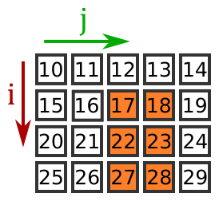

# Matrix Slicing

## Introduction

#### We are asked to implement matrix slicing in both python(Numpy) and C-like language. The main requirement is to have not fixed values, but rather ask the values from user's input.

#### This task has two implementation of the same operation in both Java and Python. Java does not support matrix slicing directly and we are required to do the things manually. However, we need to be careful to make sure neither rows count nor column's count exceeds the size of matrix.

#### For example, if we ask to slice row 2 - 4 and column 3 - 4. Then the result would end up being below.

#### In Java :

#### We have the class called `MatrixUtil` which contains the core logic for slicing the matrix. I wrote it in that way so that other methods (add, subtract) etc, can later be added without changing the main logic.
####  It uses two nested loops over plain arrays: it calculates the target row and column counts, allocates a new 2D array, and copies each element from `source[rowStart + i][columnStart + j]`. `Main` reads the matrix and slice bounds from the console, calls that method, and prints the sub-matrix together with the elapsed time.

#### In Python :
#### The array version is `matrix_slicing.py`. It is relatively shorter than writing in Java because the slice is simple single expression `source[row_start : row_end + 1, col_start : col_end + 1]` on NumPy arrays.

## Unit tests

#### `MatrixUtilTest` checks the slicing method against sub-matrices that were calculated by hand:

#### - extracting a 3×3 sub-matrix from a 5×5 source matrix: rows 1..3 and columns 1..3 from `[[0, 10, 20, 30, 40], ...]` equals `[[60, 70, 80], [110, 120, 130], [160, 170, 180]]`
#### - extracting a single 1×1 element at `[1][1]` from a 2×2 matrix equals `[[4]]`
#### - slicing the full range of a matrix returns an identical copy of the matrix
#### - slicing a single row produces a 1×N row vector `[[4, 5, 6]]`
#### - slicing a single column produces an N×1 column vector `[[2], [5], [8]]`

#### The run printed `All matrix slicing tests passed`.

## Execution time

#### Both measurements time only the slicing operation. Building the matrices and reading user input are outside the timer.

#### On small sub-matrices, NumPy creates a zero-copy array view in negligible time (~0.001 ms). The Java nested loops create a brand new 2D array and copy memory, taking a similar time under a microsecond.

#### Both solutions give identical numerical outputs and match pixel-for-pixel when rendered graphically.